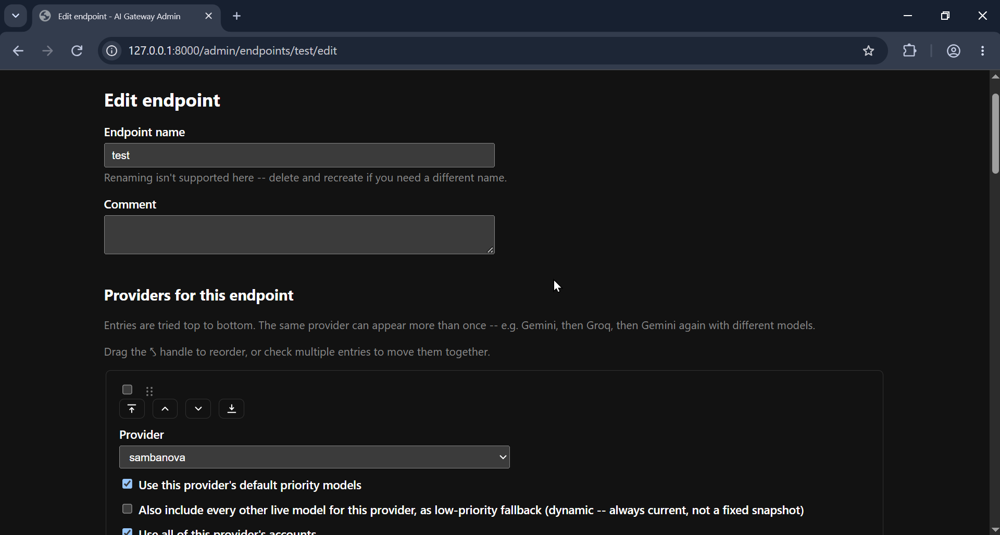

<p align="center">
  
</p>

<p align="center">
  <a href="docs/walkthrough.md">Walkthrough</a> ·
  <a href="docs/README.md">Docs</a> ·
  <a href="docs/design-notes.md">Design Notes</a> ·
  <a href="LICENSE">License</a> ·
  <a href="#contact">Contact</a>
</p>

<p align="center">
  <a href="https://github.com/ahmshili/LLMPivot/actions/workflows/tests.yml"></a>
  <a href="LICENSE"></a>
  
  
  
  <a href="#sponsorship"></a>
</p>

# PivotLLM

**A self-healing API gateway for LLMs.** It sits in front of multiple AI
providers (Gemini, Groq, OpenRouter, Mistral, GitHub Models, ...) and
exposes them as a single, standard OpenAI-compatible endpoint. If one
provider, model, or account fails or runs out of quota, PivotLLM
automatically retries the next one in line — no dropped requests, no
manual account juggling.

## For recruiters & non-technical reviewers

**The problem:** most free-tier AI APIs cap how many requests you can
make per day. An app or script that relies on one provider simply stops
working once that cap is hit.

**What this project does about it:** PivotLLM sits between your
application and several different AI providers at once. When a request
comes in, it tries the first available provider/account; if that one is
out of quota, temporarily broken, or misconfigured, PivotLLM
automatically falls back to the next one — instantly, and invisibly to
whatever application is calling it. It also ships a full web dashboard
so providers, accounts, and routing priority can be managed by clicking
around instead of hand-editing configuration files.

**What it demonstrates technically:**
- Designing a small system out of clearly separated, single-purpose
  components rather than one large tangled script (see
  [Why it's built this way](#why-its-built-this-way))
- Building and documenting a real HTTP API (FastAPI) that's compatible
  with an existing industry-standard interface (OpenAI's API format)
- Schema-validated configuration, structured error/failure handling,
  and a 190+ test automated test suite running in CI on every push
- A full server-rendered web UI (no separate frontend framework) for
  managing the system's state safely
- Clear, deliberate documentation of engineering trade-offs, not just
  code — see [`docs/design-notes.md`](docs/design-notes.md)

The rest of this document goes into the technical detail behind those
points. If you'd rather see it running, [`docs/walkthrough.md`](docs/walkthrough.md)
has a full walkthrough with screenshots.

---

Built to solve a real, everyday problem: running LLM-powered apps
cheaply across several providers' free tiers means constantly watching
quotas and swapping keys by hand. PivotLLM automates that entirely,
with a web dashboard to manage everything.

## Table of contents

- [What it does](#what-it-does)
- [Architecture](#architecture)
- [Tech stack](#tech-stack)
- [Quickstart (evaluation only — see License)](#quickstart-evaluation-only--see-license)
- [A look at the admin dashboard](#a-look-at-the-admin-dashboard)
- [Documentation](#documentation)
- [Development](#development)
- [Why it's built this way](#why-its-built-this-way)
- [Usage disclaimer](#usage-disclaimer)
- [Issues, feedback & contributions](#issues-feedback--contributions)
- [Sponsorship](#sponsorship)
- [License](#license)
- [Contact](#contact)

## What it does

- **One endpoint, many providers.** Any tool that speaks the OpenAI API
  (chat apps, coding assistants, internal scripts) can point at
  PivotLLM and get automatic failover across providers and accounts,
  with zero code changes on the client side.
- **Smart, not just "retry on error."** Failures are classified (bad
  key, quota exhausted, model typo, network blip, etc.) and handled
  differently — a bad API key is disabled immediately, a rate limit
  backs off and retries, a quota hit waits it out. See
  [`docs/routing.md`](docs/routing.md) for the full logic.
- **Web admin dashboard.** Add providers, rotate API keys, reorder
  fallback priority, and test accounts live — all through a UI, no
  manual YAML editing required. See [`docs/admin-ui.md`](docs/admin-ui.md).
- **Config-as-code, safely.** Settings are validated against a schema
  generated straight from the code, so a broken config can't ship.
  Secrets are always kept out of version control.

## Architecture

```
OpenAI-compatible clients
                              │
                              ▼
                     PivotLLM (this project)
         ─────────────────────────────────────────
         ConfigManager · CandidateResolver · Router
         FailureClassifier · CooldownManager
         GatewayClient
         ─────────────────────────────────────────
                              │
                              ▼
                LiteLLM (transport only, no accounts)
                              │
                              ▼
         Gemini · Groq · OpenRouter · DeepSeek · ...
```

PivotLLM doesn't replace [LiteLLM](https://github.com/BerriAI/litellm) —
LiteLLM stays the transport layer that talks to each provider's SDK.
PivotLLM owns everything around that: configuration, account pools,
routing order, failure handling, and retries.

## Tech stack

Python · FastAPI · Pydantic (schema-validated YAML config) · Jinja2 +
HTMX (server-rendered admin UI) · pytest (190+ tests, ~4,000 lines of
application code).

## Quickstart (evaluation only — see License)

This project is shared under a **portfolio/source-available license**
(see [License](#license) below), not an open-source one. The steps
below are provided so a reviewer, interviewer, or curious reader can run
the project locally to see it work — they are **not** an invitation to
deploy it for real, ongoing, or production use. If you'd like to use
this beyond local evaluation, reach out first (see [Contact](#contact)).

**Prerequisites:** Python 3.13+, [`uv`](https://docs.astral.sh/uv/getting-started/installation/), and Docker (for LiteLLM). One-liner to get `uv` itself:

| OS | Install command |
|---|---|
| macOS / Linux | `curl -LsSf https://astral.sh/uv/install.sh \| sh` |
| Windows (PowerShell) | `powershell -ExecutionPolicy ByPass -c "irm https://astral.sh/uv/install.ps1 \| iex"` |

`uv` manages the correct Python version for you — no separate Python install needed. Installing Docker itself, and other install methods per OS, are covered in [`docs/installation.md`](docs/installation.md).

```bash
# 1. Start LiteLLM (the transport layer PivotLLM routes through)
docker run -d --name litellm -p 4000:4000 \
  -v $(pwd)/litellm-config.example.yaml:/app/config.yaml \
  -e GEMINI_API_KEY=placeholder \
  ghcr.io/berriai/litellm:main-stable \
  --config /app/config.yaml --port 4000

# 2. Configure PivotLLM
cp config.example.yaml config.yaml
cp .env.example .env        # fill in your provider API keys

# 3. Run
uv sync
uv run ai-gateway --port 8000
```

Then send a standard OpenAI-style request to `http://localhost:8000/v1/chat/completions`,
or open `http://localhost:8000/admin/` to manage providers and accounts visually.

That `docker run` command is enough to get started; for running both
services together with Docker Compose (recommended once you're past
the first test), see [`docs/docker.md`](docs/docker.md). Full
LiteLLM-side config, environment variables, and securing the gateway are
in [`docs/configuration.md`](docs/configuration.md).

## A look at the admin dashboard

<p align="center">
  
</p>

<p align="center">
  
</p>

A complete, step-by-step walkthrough — installing, adding providers and
accounts, building a virtual endpoint, and pointing a real AI assistant
([opencode](https://opencode.ai)) at PivotLLM as a drop-in OpenAI
endpoint — is in [`docs/walkthrough.md`](docs/walkthrough.md).

## Documentation

- [`docs/walkthrough.md`](docs/walkthrough.md) — full install-to-first-request walkthrough with screenshots
- [`docs/installation.md`](docs/installation.md) — installing Python/uv and LiteLLM prerequisites on Linux, macOS, and Windows
- [`docs/routing.md`](docs/routing.md) — how requests are routed and retried, failure types, cooldown rules
- [`docs/configuration.md`](docs/configuration.md) — full config reference, LiteLLM setup, securing the gateway
- [`docs/admin-ui.md`](docs/admin-ui.md) — every admin UI feature in detail
- [`docs/api.md`](docs/api.md) — API endpoint reference
- [`docs/docker.md`](docs/docker.md) — running LiteLLM and PivotLLM with Docker, including the two-container Compose setup
- [`docs/design-notes.md`](docs/design-notes.md) — engineering decision log: why things were built this way, bugs found along the way, and tradeoffs made deliberately

## Development

```bash
uv sync --extra dev
uv run pytest
```

Tests run automatically on every push via GitHub Actions (see the
"Tests" badge above).

## Why it's built this way

No microservices, no database, no message queue, no background workers —
just six small, single-responsibility components
(`ConfigManager`, `CandidateResolver`, `Router`, `FailureClassifier`,
`CooldownManager`, `GatewayClient`), each easy to reason about in
isolation. `GatewayClient` is the only class that knows LiteLLM exists,
so swapping the transport later only touches one file. More on these
tradeoffs in [`docs/design-notes.md`](docs/design-notes.md).

## Usage disclaimer

PivotLLM is a routing and orchestration tool — it does not grant access
to any LLM provider, and it does not change the terms you agreed to when
you signed up for one. **Any use of this project must comply with the
usage policy, rate limits, and terms of service of each LLM provider you
connect it to.**

You are solely and entirely responsible for how you obtain, configure,
and use this software and your own provider accounts — including any
consequences from combining or rotating across free-tier accounts, and
including any use that falls outside what the [License](#license)
authorizes. The author accepts no liability for how the software is
used, whether that use is authorized or not, and whether or not it
turns out to violate a law or a contract you hold with someone else —
see [LICENSE](LICENSE) for the full terms.

## Issues, feedback & contributions

Bug reports, feature suggestions, and general feedback are very welcome
via [GitHub Issues](https://github.com/ahmshili/LLMPivot/issues) — that's
the best place to flag something broken, propose an improvement, or ask
a question about the design.

Pull requests improving the project are genuinely welcome, with one
condition tied to this project's license (see below): changes should be
proposed directly against this repository via PR rather than developed
and kept in a separate fork or mirror maintained elsewhere. Before
opening a larger PR, opening an issue first to discuss the approach is
appreciated, but not required for small fixes.

## Sponsorship

If PivotLLM saves you time or money on LLM API costs, sponsorships are
welcome and appreciated — they help justify continued maintenance and
new features. Sponsorship links will be added here once set up; in the
meantime, a ⭐ on the repo or a mention if you're using it in your own
project both go a long way (mentions must credit and link back to the
original repository — see License).

## License

PivotLLM is **source-available, for viewing and local evaluation only** —
this is **not** an MIT/OSI-style open-source license, and it is stricter
than a typical "personal use" license. In short:

- ✅ Anyone may read the code and run it locally purely to evaluate it (e.g. for a hiring process or code review)
- ✅ Modifications may be contributed back via pull request to this repository
- ❌ Private, personal, or production use beyond local evaluation is **not** permitted without the author's written consent
- ❌ Commercial use is not permitted
- ❌ Redistribution, rehosting, or maintaining a separate fork/copy elsewhere is not permitted
- ❌ Claiming this work, in original or modified form, as your own is not permitted
- No warranty is provided, and the author bears no liability for how the software is used — including for any use that falls outside these terms (see the disclaimer above)
- Any mention or showcase of this project, anywhere, must credit and link back to [this repository](https://github.com/ahmshili/LLMPivot)
- Author/contact/repository notices embedded in the source code, API responses, and admin UI must not be removed or altered

Full terms are in [`LICENSE`](LICENSE). This is not legal advice — if
you need certainty about a specific use case, consult a lawyer, or
[reach out](#contact) directly.
