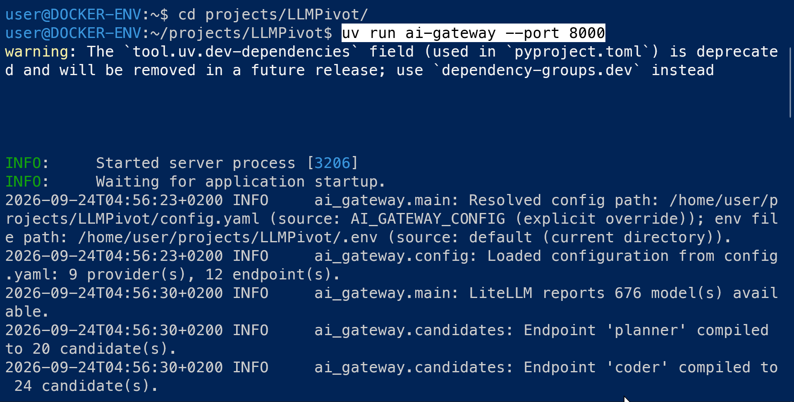
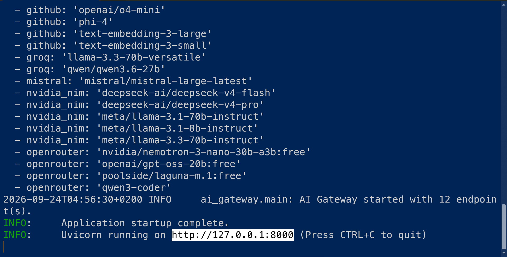
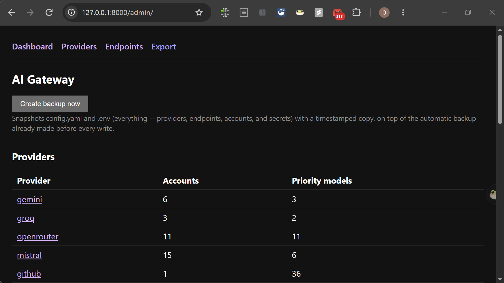
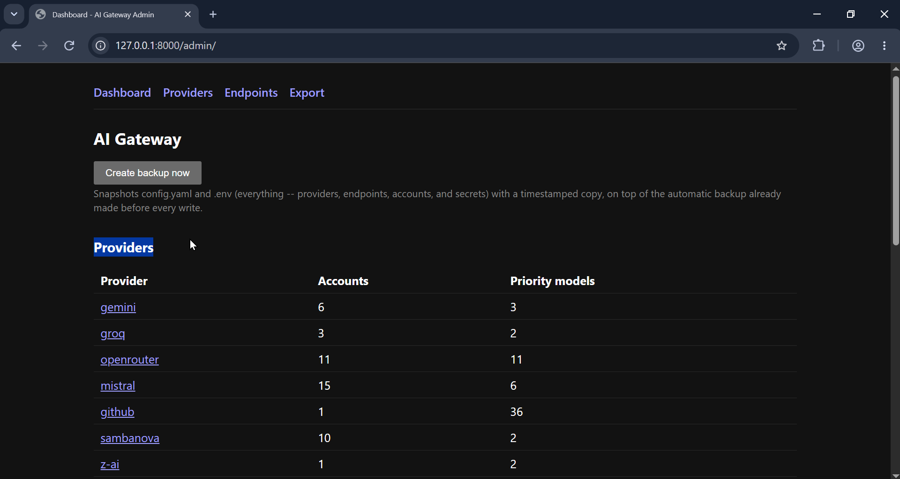
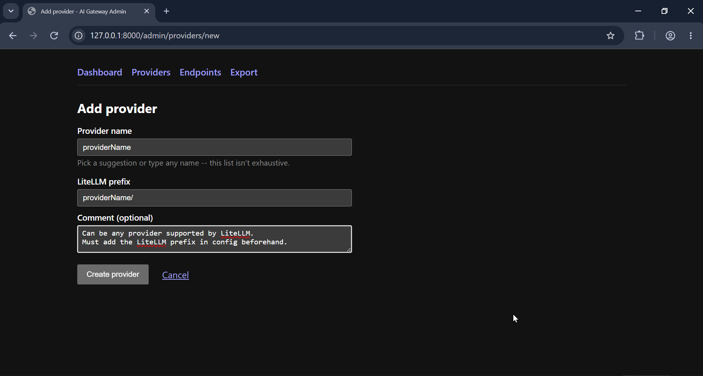
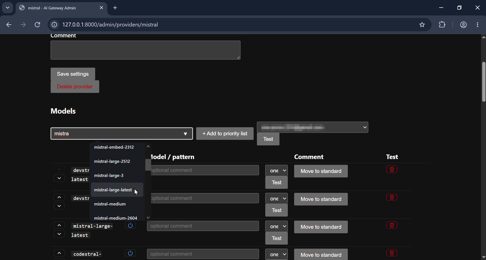

# LLMPivot

**A self-healing API gateway for LLMs.** It sits in front of multiple AI
providers (Gemini, Groq, OpenRouter, Mistral, GitHub Models, ...) and
exposes them as a single, standard OpenAI-compatible endpoint. If one
provider, model, or account fails or runs out of quota, LLMPivot
automatically retries the next one in line — no dropped requests, no
manual account juggling.

Built to solve a real, everyday problem: running LLM-powered apps
cheaply across several providers' free tiers means constantly watching
quotas and swapping keys by hand. LLMPivot automates that entirely,
with a web dashboard to manage everything.

## What it does

- **One endpoint, many providers.** Any tool that speaks the OpenAI API
  (chat apps, coding assistants, internal scripts) can point at
  LLMPivot and get automatic failover across providers and accounts,
  with zero code changes on the client side.
- **Smart, not just "retry on error."** Failures are classified (bad
  key, quota exhausted, model typo, network blip, etc.) and handled
  differently — a bad API key is disabled immediately, a rate limit
  backs off and retries, a quota hit waits it out. See
  [`docs/routing.md`](docs/routing.md) for the full logic.
- **Web admin dashboard.** Add providers, rotate API keys, reorder
  fallback priority, and test accounts live — all through a UI, no
  manual YAML editing required. See [`docs/admin-ui.md`](docs/admin-ui.md).
- **Config-as-code, safely.** Settings are validated against a schema
  generated straight from the code, so a broken config can't ship.
  Secrets are always kept out of version control.

## Architecture

```
OpenAI-compatible clients
                              │
                              ▼
                     LLMPivot (this project)
         ─────────────────────────────────────────
         ConfigManager · CandidateResolver · Router
         FailureClassifier · CooldownManager
         GatewayClient
         ─────────────────────────────────────────
                              │
                              ▼
                LiteLLM (transport only, no accounts)
                              │
                              ▼
         Gemini · Groq · OpenRouter · DeepSeek · ...
```

LLMPivot doesn't replace [LiteLLM](https://github.com/BerriAI/litellm) —
LiteLLM stays the transport layer that talks to each provider's SDK.
LLMPivot owns everything around that: configuration, account pools,
routing order, failure handling, and retries.

## Tech stack

Python · FastAPI · Pydantic (schema-validated YAML config) · Jinja2 +
HTMX (server-rendered admin UI) · pytest (160+ tests, ~4,000 lines of
application code).

## Quickstart

```bash
# 1. Configure
cp config.example.yaml config.yaml
cp .env.example .env        # fill in your provider API keys

# 2. Run (requires a LiteLLM instance as transport — see docs/configuration.md)
uv sync
uv run ai-gateway --port 8000
```

Then send a standard OpenAI-style request to `http://localhost:8000/v1/chat/completions`,
or open `http://localhost:8000/admin/` to manage providers and accounts visually.

Full setup details (LiteLLM-side config, environment variables, securing
the gateway) are in [`docs/configuration.md`](docs/configuration.md).

## Guide
First we run the app through (It will download all required dependencies of the project with the uv utility)
```
uv run ai-gateway --port 8000
```



When Application Startup is completed. We should have the app accessible through this address
```
http://127.0.0.1:8000/admin/
```



We can add providers through the graphical interface (LiteLLM Must have it configured it first as a /providerName in its config file)

Same thing for Virtual endpoints (will point to either provider or a list of models of a specific provider organized as a list)


## Configuration example

<!-- screenshot: admin dashboard overview -->
<!-- screenshot: adding/testing a provider account -->
<!-- screenshot: endpoint routing configuration -->


## Documentation

- [`docs/routing.md`](docs/routing.md) — how requests are routed and retried, failure types, cooldown rules
- [`docs/configuration.md`](docs/configuration.md) — full config reference, LiteLLM setup, securing the gateway
- [`docs/admin-ui.md`](docs/admin-ui.md) — every admin UI feature in detail
- [`docs/api.md`](docs/api.md) — API endpoint reference
- [`DESIGN_NOTES.md`](DESIGN_NOTES.md) — engineering decision log: why things were built this way, bugs found along the way, and tradeoffs made deliberately

## Development

```bash
uv sync --extra dev
uv run pytest
```

## Why it's built this way

No microservices, no database, no message queue, no background workers —
just six small, single-responsibility components
(`ConfigManager`, `CandidateResolver`, `Router`, `FailureClassifier`,
`CooldownManager`, `GatewayClient`), each easy to reason about in
isolation. `GatewayClient` is the only class that knows LiteLLM exists,
so swapping the transport later only touches one file. More on these
tradeoffs in [`DESIGN_NOTES.md`](DESIGN_NOTES.md).

## License

MIT
