Part of the [LLMPivot](../README.md) documentation.

# Walkthrough: from install to a working AI assistant

## Table of contents

- [1. Run the app](#1-run-the-app)
- [2. Add a provider, models, and an account](#2-add-a-provider-models-and-an-account)
- [3. Create a virtual endpoint](#3-create-a-virtual-endpoint)
- [4. A realistic configuration, end to end](#4-a-realistic-configuration-end-to-end)
- [5. Connect an AI assistant](#5-connect-an-ai-assistant)
- [What happens when a model hits its limit](#what-happens-when-a-model-hits-its-limit)

A full step-by-step tour of setting up LLMPivot, configuring providers
and accounts through the admin UI, and pointing a real AI coding
assistant ([opencode](https://opencode.ai)) at it as a drop-in
OpenAI-compatible endpoint.

## 1. Run the app

`uv` downloads all dependencies automatically on first run. If you
haven't installed `uv` (or a LiteLLM instance to route through) yet,
see [`docs/installation.md`](installation.md) first.

```bash
cd LLMPivot
uv run ai-gateway --port 8000
```


Once startup finishes, the admin UI is reachable at:

```
http://127.0.0.1:8000/admin/
```


**Provider list**


**Endpoint list**
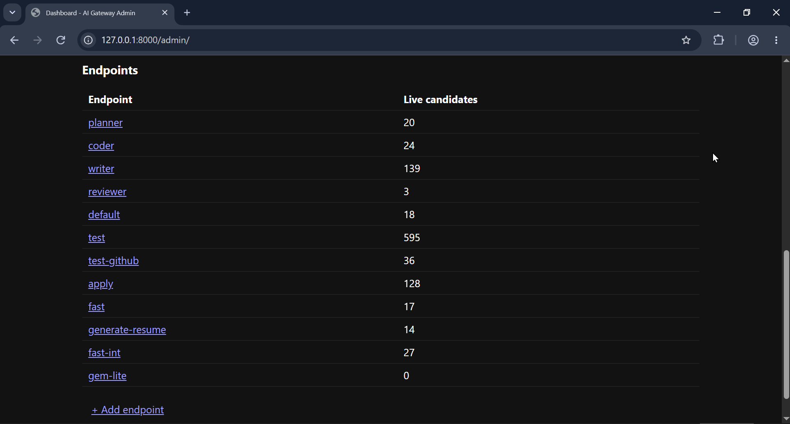

## 2. Add a provider, models, and an account

Providers are added through the graphical interface:


Then add the model list. (In this example, an invalid provider prefix
means LiteLLM's live default model list wasn't detected — in normal use
this step auto-suggests from LiteLLM's `/v1/models`.)

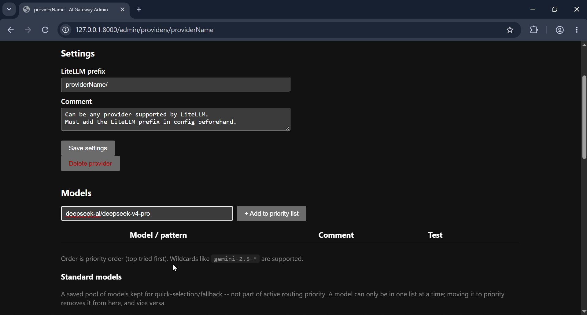

Finish setting up the provider by adding its first account:

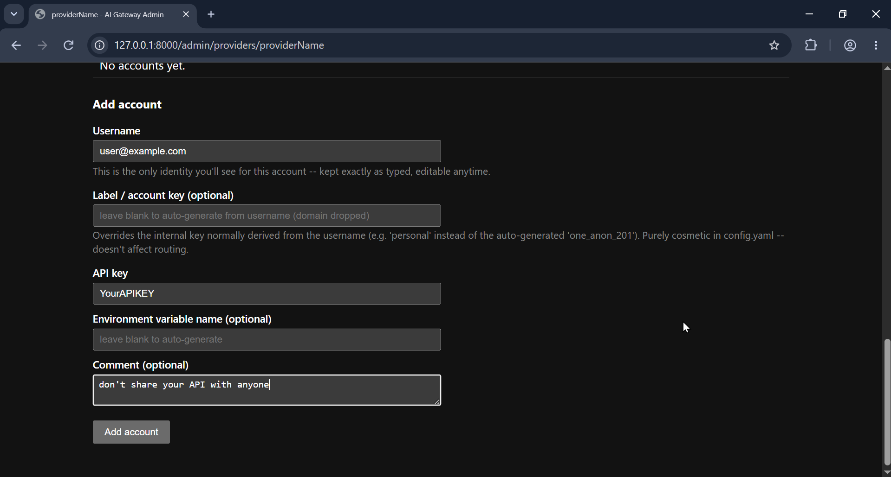

## 3. Create a virtual endpoint

A virtual endpoint points at one provider, or an ordered list of
providers and models — this is what becomes your OpenAI-compatible
`model` value.

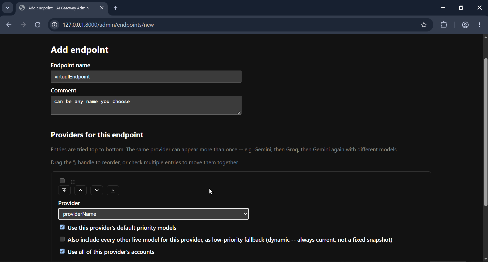

Back in `/admin/`, the new virtual endpoint appears as your gateway's
OpenAI-compatible target — the same way you'd point an assistant at an
Ollama endpoint.

## 4. A realistic configuration, end to end

A preview of what a real, filled-in configuration looks like. Make sure
your own setup stays within your providers' usage policies (see the
[disclaimer](../README.md#usage-disclaimer) in the main README).

**Provider list**


**Account list**
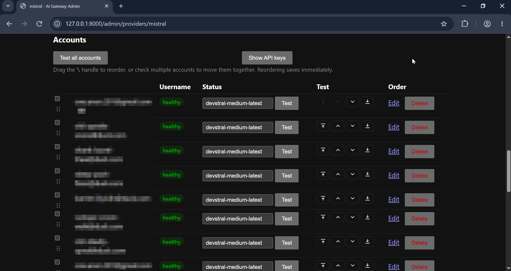

**Endpoint list**

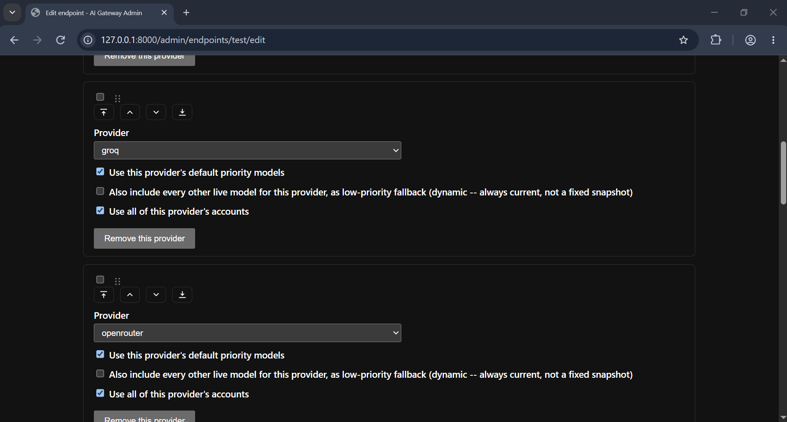
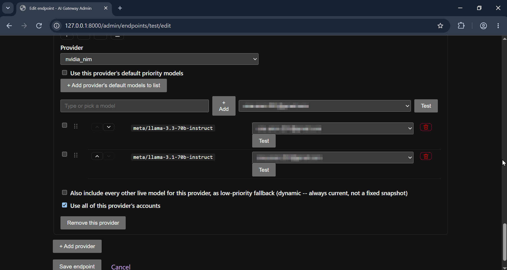

## 5. Connect an AI assistant

Using [opencode](https://opencode.ai) as an example. First, set up the
endpoint:

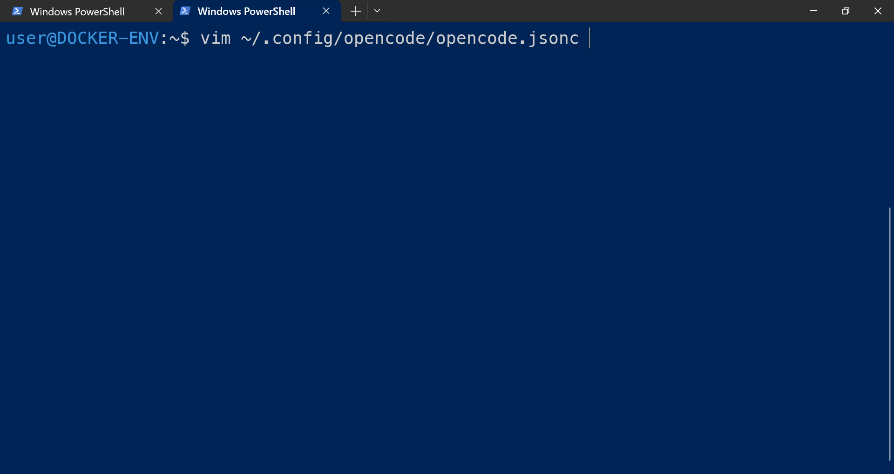

Configure it like this:

```json
{
  "$schema": "https://opencode.ai/config.json",
  "model": "local-proxy/fast",
  "provider": {
    "local-proxy": {
      "npm": "@ai-sdk/openai-compatible",
      "name": "Local Multi-Provider Proxy",
      "options": {
        "baseURL": "http://127.0.0.1:8000/v1",
        "streaming": false
      },
      "models": {
        "fast": { "name": "Fast Model" },
        "test": { "name": "Test Model" }
      }
    }
  }
}
```

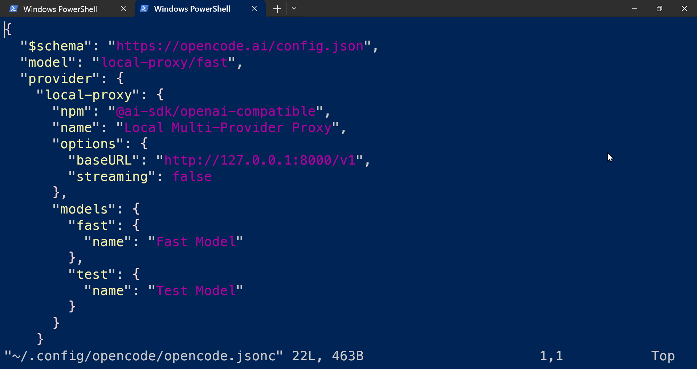

Launch the assistant:

```bash
opencode
```

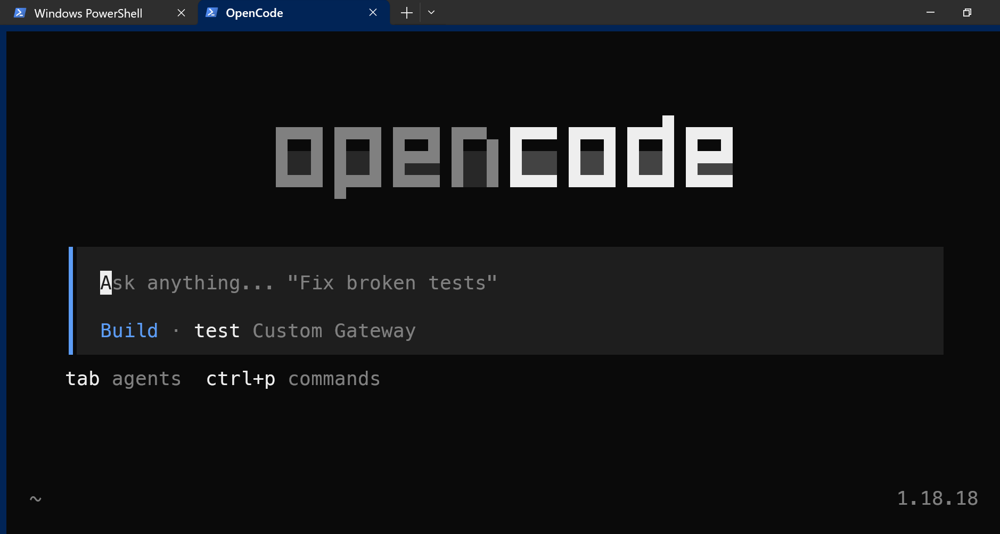

Run `/models` and confirm the `/test` endpoint is selected:

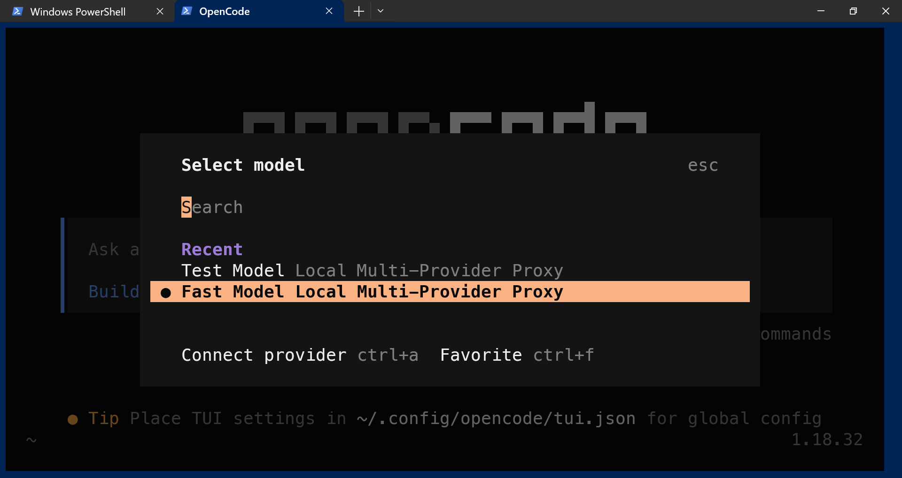

Send a simple prompt:

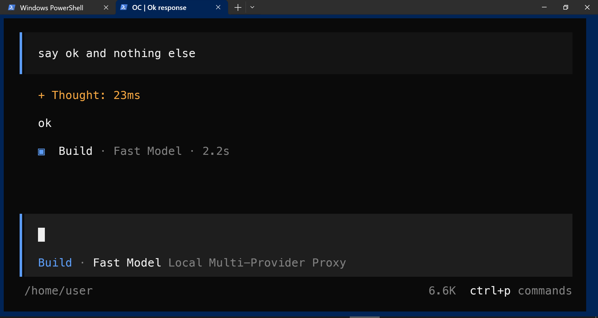

The gateway's own logs confirm the custom endpoint was used:

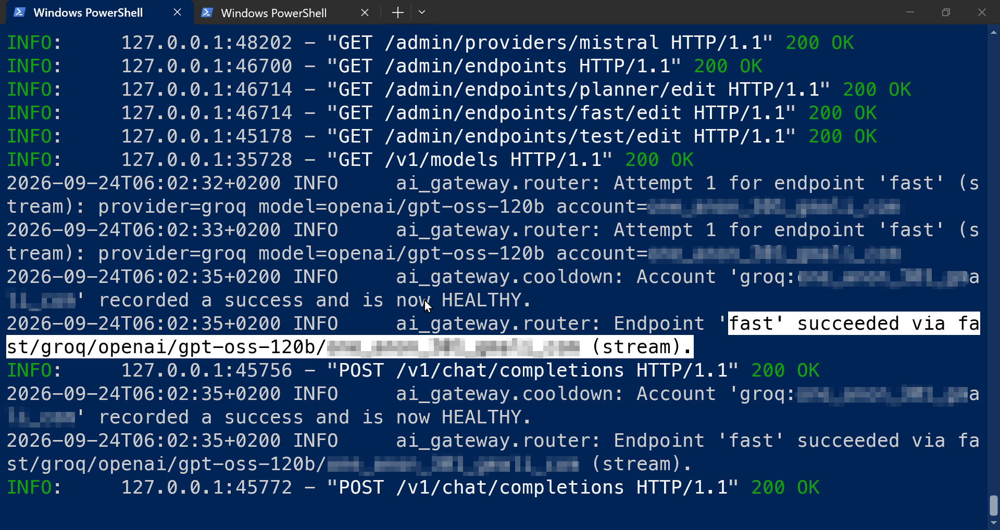

## What happens when a model hits its limit

When a priority model hits a quota limit or becomes unavailable,
LLMPivot automatically switches to the next model on the list — no
manual intervention needed. This is what makes it practical to run an
AI assistant entirely on free-tier LLM APIs.

**Note:** streaming responses are also supported when enabled in the AI
assistant's settings.

Here is an example of a fallback chain from the gateway's Logs 
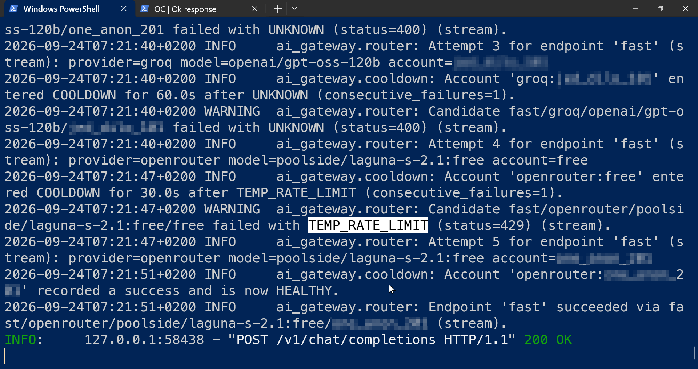