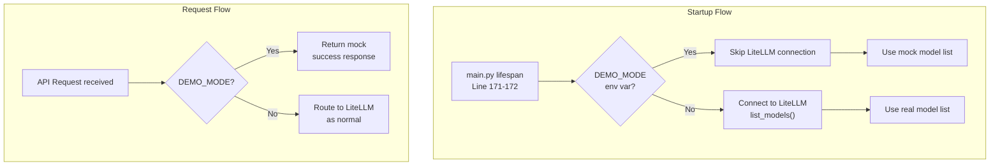

# Demo Mode Implementation Plan for LLMPivot

## Problem Summary

When deployed to Render.com, the application fails at startup because it attempts to connect to `localhost:4000` (LiteLLM) during the lifespan initialization in `main.py:172`. This connection fails with `httpx.ConnectError: All connection attempts failed`.

## Goal

Introduce a **Demo Mode** that allows the application to start and present a working frontend for recruiters without requiring an actual LiteLLM backend.

## Proposed Solution

### Architecture Overview



### Environment Variable

```bash
DEMO_MODE=true  # Enables demo mode, skips LiteLLM connection
```

### Files to Modify

| File | Change |
|------|--------|
| `src/ai_gateway/config/models.py` | Add `demo_mode: bool = False` to `LiteLLMConfig` |
| `src/ai_gateway/gateway_client.py` | Add mock `list_models()` and mock request methods |
| `src/ai_gateway/main.py` | Check `DEMO_MODE` env var, skip/catch LiteLLM connection |
| `.env.example` | Add `DEMO_MODE=` entry |
| `config.example.yaml` | Add `demo_mode: false` under `litellm:` section |
| `config.schema.json` | Regenerate schema to include `demo_mode` |

### Implementation Details

#### 1. GatewayClient Enhancement

```python
# New method in GatewayClient
def _is_mock_mode(self) -> bool:
    return self._config.demo_mode

async def list_models(self) -> list[str]:
    if self._is_mock_mode():
        # Return known model list from config
        return self._get_demo_models()
    # Existing implementation...
```

#### 2. Mock Response Generation

For chat completion requests in demo mode, return a minimal valid OpenAI-compatible response:

```json
{
  "id": "chatcmpl-mock-demo",
  "object": "chat.completion",
  "created": 1234567890,
  "model": "gemini-2.5-flash",
  "choices": [{
    "index": 0,
    "message": {
      "role": "assistant",
      "content": "Demo response - LiteLLM not connected"
    },
    "finish_reason": "stop"
  }]
}
```

#### 3. Lifespan Error Handling

In `main.py`, wrap the LiteLLM connection in a try-except when `DEMO_MODE=true`:

```python
if os.environ.get("DEMO_MODE", "").lower() == "true":
    logger.warning("Demo mode active: skipping LiteLLM connection")
    available_models = []
else:
    try:
        available_models = await gateway_client.list_models()
    except Exception as exc:
        logger.error("Failed to connect to LiteLLM: %s", exc)
        raise
```

### Configuration Changes

#### config.yaml
```yaml
litellm:
  base_url: "http://localhost:4000"
  timeout_seconds: 30
  demo_mode: true  # New field
```

#### .env
```
DEMO_MODE=true
```

### Benefits

1. **No LiteLLM dependency** - App starts without any backend
2. **All endpoints visible** - Routes render correctly in UI
3. **No red flags** - Admin UI loads, models appear configured
4. **Easy toggle** - Set `DEMO_MODE=true` in Render environment variables
5. **Minimal code changes** - Only 3-4 core files modified

### Testing Verification

- [ ] App starts with `DEMO_MODE=true` and no LiteLLM instance
- [ ] `/v1/models` returns mock model list
- [ ] `/v1/chat/completions` returns mock response
- [ ] Admin UI loads and displays endpoints
- [ ] Existing functionality unchanged when `DEMO_MODE=false`